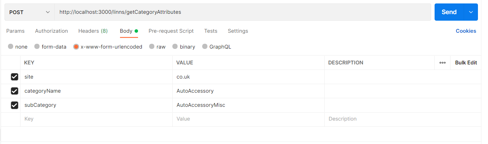

# How to run

### install Dependencies

```bash
npm install
```

### run the app

```bash
npm start
```

### Get All Categories

> make a post request to the following endpoint.

> response will be an array of marketplaces and categories

```bash
http://localhost:3000/linns/getAmazonCategories
```

### Get the required csv file

> make a post request to the following endpoint.

> The request body should be form-url-encoded with the following keys:

> > site: i.e co.uk You can get the list of sites from the response of the previous endpoint (getAmazonCategories)

> > categoryName: i.e "AutoAccessory"

> > subCategory: i.e "AutoAccessoryMisc"

> response will be a csv file

```http
http://localhost:3000/linns/getCategoryAttributes
```


